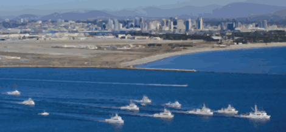

[](https://travis-ci.org/YeoLab/flotilla)[](https://coveralls.io/r/YeoLab/flotilla?branch=master)

flotilla
========




Proudly sponsored by a NumFOCUS John Hunter Technical Fellowship to Olga
Botvinnik.

Installation instructions
=========================

From a clean install of Mavericks 10.9.4, follow these steps.

All others must fend for themselves to install matplotlib, scipy and their third-party dependencies.

 *This part only needs to be done once*

 * [Install anaconda](https://store.continuum.io/cshop/anaconda/)
 * [Install Xcode (this can take an hour)](https://itunes.apple.com/us/app/xcode/id497799835?mt=12)
 * Open Xcode and agree to terms and services (it is very important to read them thoroughly)
 * Install [homebrew](http://brew.sh/)


    `ruby -e "$(curl -fsSL https://raw.github.com/Homebrew/homebrew/go/install)"`


 * Install freetype:


    `brew install freetype`


 * Install heavy packages (this can take an hour or more)

```
conda install pip numpy scipy cython matplotlib nose six scikit-learn ipython networkx pandas tornado statsmodels setuptools pytest pyzmq jinja2 pyyaml`
```

 * Create a virtual environment
```
conda create -n flotilla_env pip numpy scipy cython matplotlib nose six scikit-learn ipython networkx pandas tornado statsmodels setuptools pytest pyzmq jinja2 pyyaml`
```

 * Switch to virtual environment


    `source activate flotilla_env`


 * Install flotilla and its dependencies (this can take a few minutes):


    `pip install git+https://github.com/YeoLab/flotilla.git`


 * Create a scratch space for your work


    `mkdir ~/flotilla_scratch`


 * Make a place to store flotilla projects


    `mkdir ~/flotilla_projects`


 * Go back to the real world

    `source deactivate`


Start using flotilla:
=====================

 Use the above instructions to create a flotilla-friendly environment, then:


 * switch to virtual environment


    `source activate flotilla_env`


 * start an ipython notebook:


    `ipython notebook --notebook-dir=~/flotilla_scratch`


 * create a new notebook by clicking `New Notebook`
 * rename your notebook from "Untitled" to something more informative by clicking the title panel.
 * load matplotlib backend using every notebook must use this to display inline output


    `%matplotlib inline`

Test interactive features with example data:
------------

We have prepared a slice of the full dataset for testing and demonstration purposes.

Run each of the following code lines in its own ipython notebook cell for an interactive feature.

    import flotilla
    test_study = flotilla.embark('http://sauron.ucsd.edu/flotilla_projects/neural_diff_chr22/datapackage.json')

    test_study.interactive_pca()

    test_study.interactive_graph()

    test_study.interactive_classifier()

    test_study.interactive_lavalamp_pooled_inconsistent()

IMPORTANT NOTE: for this test,several failures are expected since the test set is small.
Adjust parameters to explore valid parameter spaces.
For example, you can manually select `all_genes` as the `feature_subset`
from the drop-down menu that appears after running these interactive functions.


